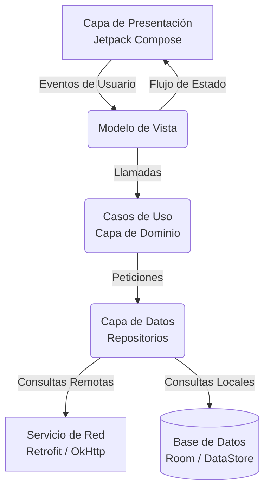

# Arquitectura de la Aplicación

El proyecto de Amani Android se estructura con un enfoque modular, netamente mantenible y preparado para escalar a medida que el número de desarrolladores aumenta. Se han utilizado los estándares recomendados oficiales para el desarrollo moderno y limpio en Android.

## Principios Fundamentales

1. **Separación de Responsabilidades**: Cada clase, capa o módulo tiene una única responsabilidad definida, lo que simplifica la creación de pruebas unitarias y el aislamiento de fallos técnicos.
2. **Arquitectura Reactiva**: A través del uso intensivo de flujos y corrutinas, la aplicación responde de manera completamente asíncrona a cualquier cambio en el estado del usuario o de los datos remotos.
3. **Flujo de Datos Unidireccional**: La interfaz visual emite intenciones hacia el modelo de vista, el cual procesa la lógica y expone un único estado inmutable hacia la vista, evitando problemas de concurrencia y estados visuales inconsistentes.

## Diagrama de Capas

A continuación, se detalla el flujo de información utilizando un diagrama arquitectónico:

## Detalles por Capa

### Capa de Presentación (UI)
- **Jetpack Compose**: Se utiliza íntegramente para toda la interfaz visual de la aplicación, siguiendo rigurosamente la especificación oficial.
- **Modelos de Vista**: Retienen el estado y manejan las acciones provenientes de la interfaz. Implementados para sobrevivir a los cambios de configuración del dispositivo.
- **Enrutamiento**: Utiliza la navegación declarativa para mover al usuario entre pantallas.

### Capa de Dominio (Domain)
- Es el verdadero corazón de la lógica de negocio de Amani Android.
- Contiene los casos de uso (<!-- TODO: verificar nombre real de casos de uso específicos si existen -->) que aplican reglas propias del sistema central.
- Siempre opera con objetos y entidades definidas exclusivamente a nivel de dominio, sin conocer el origen real de los datos.

### Capa de Datos (Data)
- **Repositorios**: Actúan como una fuente de verdad única mediando entre el almacenamiento local y remoto. Ejemplos reales en el código incluyen `PaymentRepository`, `NotificacionRepository`, `SituacionRepository` y `DiarioEmocionalRepository`.
- **Servicios Remotos**: Comunicación constante y en tiempo real con los servicios de infraestructura mediante interacciones HTTP.
- **Almacenamiento Local**: Caché local utilizando bases de datos relacionales y preferencias reactivas.

## Inyección de Dependencias

Todo el árbol de dependencias de esta arquitectura se orquesta utilizando **Koin**. Este inyector de dependencias fue seleccionado debido a su naturaleza ligera, su integración completamente nativa con Kotlin y la ausencia de generación de código complejo durante la compilación. A diferencia de otras alternativas en el mercado, Koin asegura un bajo acoplamiento, evita sobrecargas de rendimiento en tiempo de construcción y ofrece un entorno de pruebas unitarias sumamente simplificado.

!!! warning "Variables de Entorno y Configuración"
    Las configuraciones que conectan la capa de datos con la API real, como las URL base y las claves privadas del servicio de procesamiento de pagos, no deben almacenarse en texto plano. Asegúrate de inyectar estos valores desde las variables de entorno de tu máquina local al compilar.
