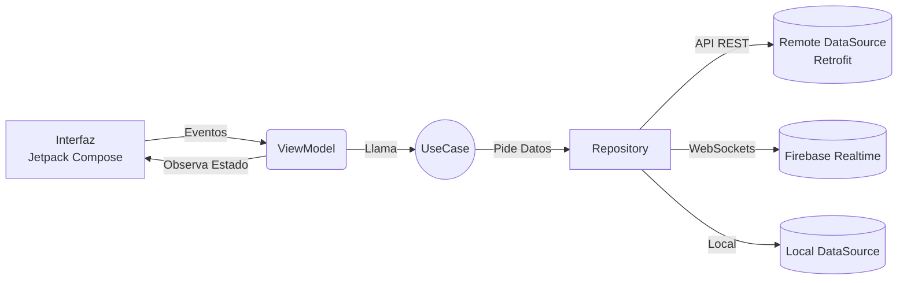

# Visión General de la Arquitectura

Para el desarrollo del cliente Android de la plataforma **AMANI**, el equipo de ingeniería ha optado por implementar una amalgama de dos patrones arquitectónicos sumamente reconocidos en la industria móvil: **MVVM** (Model-View-ViewModel) y **Clean Architecture**.

Esta decisión se tomó para garantizar que el proyecto final de ciclo académico (PFC) mantenga un estándar profesional, permitiendo escalabilidad a largo plazo, alta testabilidad y una drástica reducción del acoplamiento entre la lógica visual y los orígenes de datos.

## Diagrama de Flujo de Datos

El siguiente diagrama ilustra la dirección unidireccional en la cual fluye la información y las dependencias a través de las diferentes capas del aplicativo:

## Justificación Académica e Industrial

El proyecto posee dimensiones medianas, abarcando desde gestión de citas (agenda) hasta chat en tiempo real y visualización gráfica avanzada de estados emocionales. Intentar alojar toda esta lógica directamente en las actividades o componentes visuales (`Composables`) resultaría en el infame antipatrón "God Object", haciendo que el código sea virtualmente imposible de testear y mantener.

Al desacoplar el proyecto:
- **La Capa UI** solo dibuja el estado actual que le provee el `ViewModel`.
- **El ViewModel** se encarga puramente de la transformación de entidades hacia un estado legible para la pantalla.
- **El Caso de Uso** aloja exclusivamente la regla del negocio.
- **El Repositorio** gestiona la complejidad de decidir si los datos vienen de la base de datos local o de Firebase/Spring Boot.

!!! warning "Restricciones de Acoplamiento"
    Nunca instancies objetos directamente con constructores (`new` / `()`) cuando crucen capas arquitectónicas. Todas las dependencias representadas en el diagrama superior deben ser estrictamente administradas por el sistema de inyección (Koin), garantizando que las pruebas unitarias puedan sustituir estos bloques por falsos (mocks) con facilidad.
