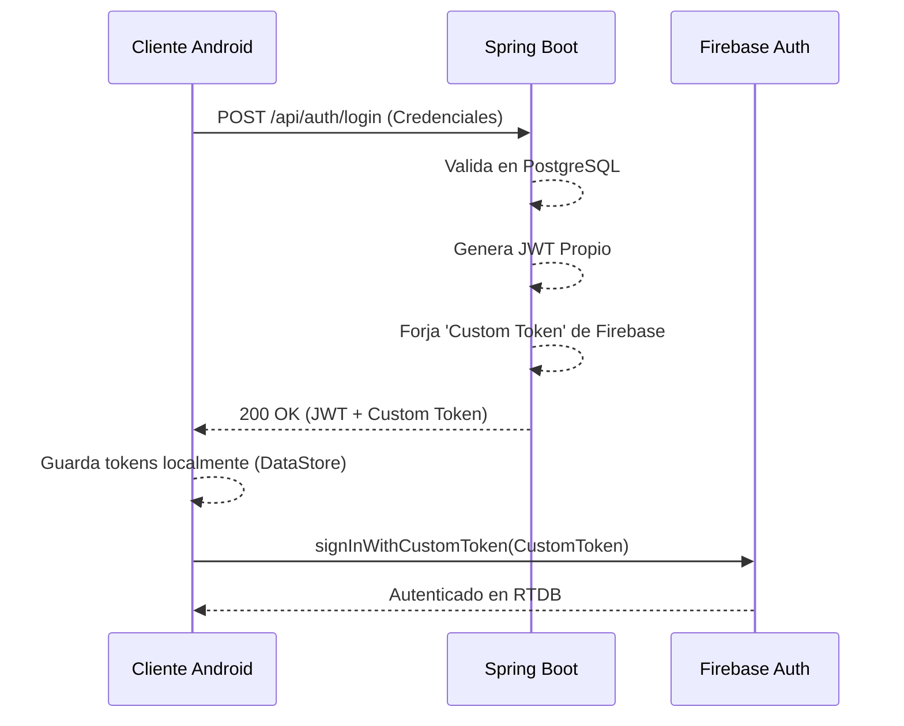

# Flujo de Autenticación Híbrido

La autenticación de usuarios en la plataforma AMANI es uno de los componentes lógicos más complejos del sistema, ya que requiere validar al paciente o psicólogo a través de nuestra propia base de datos (PostgreSQL/Spring Boot) y a la vez autorizarlo de manera fluida y transparente en los servicios en la nube de Google Firebase.

## Actores del Flujo

1. **Cliente Android**: Maneja la interacción del usuario en las pantallas visuales declarativas (`LoginScreen` o `RegisterScreen`).
2. **Backend (Spring Boot)**: Valida los nombres de usuario y contraseñas. Posee privilegios administrativos ("Service Account") para forjar llaves maestras temporales.
3. **Firebase**: Base de datos en tiempo real empleada para el chat.

## Diagrama de Secuencia

El siguiente diagrama detalla cómo estos tres actores negocian los permisos y las llaves temporales de acceso:

## Manejo de Tokens en Cliente Local

Una vez que el backend devuelve exitosamente ambos identificadores codificados tras el inicio de sesión, el sistema Android debe guardarlos localmente para mantener la sesión viva entre reinicios del dispositivo. 

El JWT es indispensable para inyectarse en los encabezados HTTP (a través de los interceptores de red de Retrofit) en cada solicitud rutinaria al servidor de Spring Boot. Por otra parte, el "Custom Token" solo se utiliza una vez para iniciar sesión directamente con el SDK de Firebase.

Ambos objetos, por tratarse de secuencias de seguridad críticas, son persistidos localmente de manera segura utilizando la biblioteca asíncrona oficial preferida del sistema: **DataStore Preferences**. A diferencia del obsoleto y sincrónico `SharedPreferences`, DataStore previene problemas graves de concurrencia y no bloquea el hilo gráfico.

!!! warning "Expiración de Sesión"
    La expiración de los JWT es manejada por el backend. El interceptor de Retrofit en Android debe estar preparado para capturar un error HTTP 401 y disparar una rutina que fuerce al usuario a la `LoginScreen` automáticamente si su token ha muerto.
