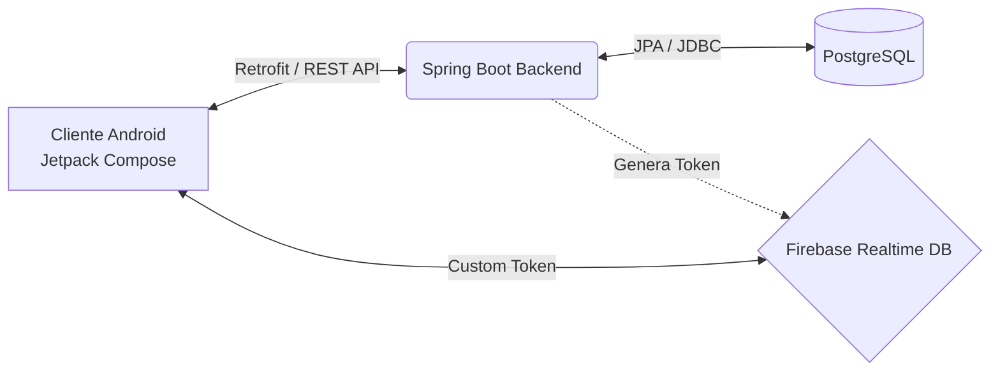

# Inicio — Documentación AMANI Android

Bienvenido a la documentación oficial del proyecto **AMANI**, una plataforma de psicología digital diseñada para conectar pacientes y psicólogos de manera eficiente y segura. El propósito fundamental de la aplicación es facilitar el seguimiento emocional de los pacientes y centralizar la agenda de sesiones, utilizando un enfoque tecnológico nativo, robusto y escalable.

El presente documento resume la arquitectura de alto nivel, la pila tecnológica y los componentes más relevantes del lado del cliente, es decir, la aplicación Android.

## Arquitectura de Alto Nivel

La infraestructura del proyecto AMANI conecta el cliente Android con múltiples servicios backend, coordinando almacenamiento local, bases de datos en tiempo real y servicios en la nube a través de peticiones HTTP.

## Pila Tecnológica (Stack Técnico)

El proyecto Android emplea tecnologías de vanguardia siguiendo fielmente las recomendaciones oficiales de Google para el desarrollo moderno:

| Capa / Dominio | Tecnología | Versión / Notas adicionales |
| :--- | :--- | :--- |
| **Lenguaje Base** | Kotlin | Uso extensivo de corrutinas (`Coroutines`) y flujos (`Flow`). |
| **Interfaz de Usuario** | Jetpack Compose | Framework declarativo junto con el sistema `Material 3`. |
| **Arquitectura** | MVVM + Clean Architecture | Separación en capas de presentación, dominio y datos. |
| **Inyección de Dependencias** | Koin | Seleccionado por su nula sobrecarga en la generación de código. |
| **Peticiones de Red (Networking)** | Retrofit | Gestiona las peticiones contra la API REST, interceptando el JWT. |
| **Autenticación y Chat** | Firebase | Realtime Database y generación dinámica de tokens personalizados. |
| **Visualización Gráfica** | Vico | Biblioteca avanzada utilizada para trazar la línea de emociones. |
| **Reporte de Errores** | Sentry + n8n | Flujo completo de integración con GitHub Issues y Gmail. |

## Acceso Rápido

Para facilitar la navegación, a continuación encontrarás enlaces directos a las áreas clave de esta documentación.

!!! tip "Arquitectura y Patrones"
    Explora la [Arquitectura General](arquitectura/vision-general.md) para entender la implementación de Clean Architecture y la inyección de dependencias con Koin.

!!! info "Funcionalidades Clave"
    Visita el diseño y la integración del [Chat con Firebase](funcionalidades/chat.md) o cómo se construye la [Gráfica de Emociones](funcionalidades/grafica-emociones.md).

!!! warning "Calidad y Despliegue"
    Antes de contribuir, asegúrate de revisar la [Estrategia de Pruebas](testing/estrategia.md) y nuestro pipeline de [CI/CD en GitHub Actions](despliegue/ci-cd.md).

## Estado del Proyecto

**Estado:** Proyecto Final de Ciclo (PFC)
**Centro:** IES Enrique Tierno Galván
**Fecha de Defensa Programada:** Mayo 2026

La aplicación AMANI es desarrollada de forma colaborativa por el equipo compuesto por Iván López Rilopa, Félix y Alejandro, bajo la tutorización directa de Diego Hernández Cañavate. Todas las decisiones arquitectónicas están avaladas por una cuidadosa fase de análisis previo.
