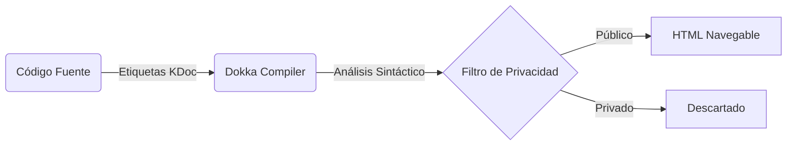

# Guía Técnica de Estándares KDoc para Amani Android

Para mantener la documentación técnica del ecosistema al día y aprovechar todo el poder automatizado de la herramienta **Dokka**, cada segmento de código relevante dentro del proyecto Amani Android debe ser documentado exhaustivamente empleando la sintaxis oficial y recomendada conocida como KDocs. Una vez ejecutado el análisis automático, el generador extraerá esta información estructurada para armar un portal web navegable sumamente útil.

## Estructura Anatómica del Comentario

Los comentarios estandarizados siempre deben iniciar con la doble apertura `/**` y finalizar de manera limpia con `*/`. La primera oración o párrafo se interpretará de forma automática como el **resumen principal** de la entidad, función o variable que estés documentando.

```kotlin
/**
 * Inicia el proceso seguro de sincronización de datos de salud con el servidor central.
 * 
 * Este método se encarga de recolectar todos los registros fisiológicos y emocionales
 * locales que estén pendientes de envío y publicarlos ordenadamente al utilizar
 * el repositorio subyacente [DiarioEmocionalRepository].
 * 
 * @param forceSync Si es configurado como verdadero, ignora la validación temporal de caché.
 * @return Un flujo reactivo que emite el estado progresivo de la subida.
 * @throws NetworkException Si hay un fallo fatal en el servicio HTTP externo.
 */
suspend fun syncData(forceSync: Boolean): Flow<SyncState> { ... }
```

## Convenciones de Etiquetas (Tags)

El uso de etiquetas enriquecidas facilita enormemente la lectura de los modelos:
- `@param [nombre_argumento]`: Describe detalladamente la razón de ser de un parámetro de entrada.
- `@return`: Explica la naturaleza y posibles variaciones del resultado devuelto por una función.
- `@throws` o `@exception`: Documenta de manera exhaustiva cualquier excepción que puede llegar a paralizar el flujo lógico.
- `@see`: Enlaza proactivamente a otras partes de la base de código relacionadas, permitiendo navegación cruzada inmediata.
- `@property [nombre_variable]`: Detalla la naturaleza de las propiedades declaradas directamente en la firma principal de un constructor primario.



## Estándar de Referencias al Código
Puedes hacer referencia a otras clases estructurales (por ejemplo dependencias inyectadas vía **Koin** como `PaymentRepository`) usando simplemente un par de corchetes `[ ]`. Si el compilador logra resolver tu referencia correctamente, construirá hipervínculos navegables.

## Requisitos de Documentación por Capas
1. **Casos de Uso (Módulo de Dominio)**: Tienen la obligación de documentar de manera explícita la regla de negocio abstracta que están ejecutando, detallando sus condiciones pre-existentes.
2. **Repositorios de Datos (Módulo de Datos)**: Requieren una explicación clara sobre el origen y las prioridades de los datos que están orquestando (por ejemplo `NotificacionRepository` maneja prioridades remotas antes que locales).
3. **Modelos de Vista (Módulo de Interfaz)**: Necesitan un resumen claro sobre la gestión del estado interno reactivo que están reteniendo.

!!! warning "Fugas de Información Interna"
    No documentes contraseñas maestras, direcciones o semillas internas dentro de tus bloques KDoc. Todo el contenido que introduzcas en estos bloques terminará siendo exportado de forma estática en las publicaciones finales de documentación HTML, quedando potencialmente expuestos a cualquier desarrollador del equipo o empleado externo con acceso al repositorio.
