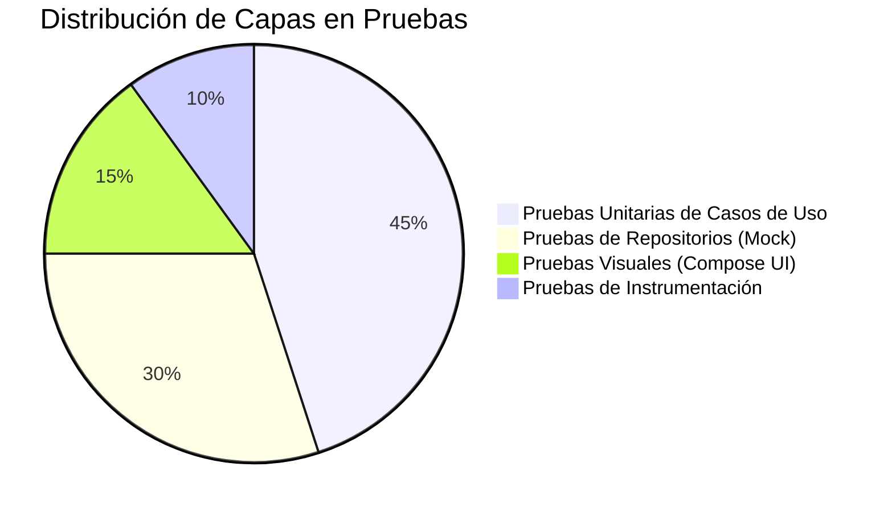

# Calidad de Código y Pruebas Estáticas

Asegurar un producto de software sumamente estable y mantenible es el objetivo principal del equipo de ingeniería detrás de Amani Android. Por esta misma razón, se han integrado de forma intrínseca dentro del proceso de compilación diversas herramientas de análisis estático del código y de aseguramiento de la calidad, garantizando buenas prácticas arquitectónicas y un reporte de errores exhaustivo.

## Análisis Estático de Código

El proyecto utiliza un conducto automatizado basado en tareas del gestor de dependencias para comprobar iterativamente la limpieza de los aportes realizados por los desarrolladores.

- **Analizador Detekt**: Actúa como la herramienta líder de análisis estático. Su principal propósito es encontrar "malos olores en el código", estructuras ineficientes y romper compilaciones que superen los umbrales de complejidad ciclomática permitida. La configuración estricta reside en el archivo `config/detekt/detekt.yml`.
- **Formateador Ktlint**: Encargado de imponer un estilo de formato rígido y estándar para toda la base de código. Evita discrepancias de formato visual (espacios, saltos de línea y tabulaciones) logrando que todos los desarrolladores envíen un código unificado.
- **Plataforma SonarQube**: Servidor de validación de calidad y seguridad continua que se integra con el repositorio principal. Se encarga de reportar métricas visuales en paneles respecto a la deuda técnica, posibles brechas de seguridad o riesgos críticos y vulnerabilidades lógicas.

## Pruebas de Verificación (Testing)

El ciclo de evaluación lógica está meticulosamente diseñado para abarcar desde pequeñas funciones matemáticas hasta flujos visuales interactivos.

1. **Pruebas Unitarias Aisladas**:
   - Componente base de validación y afirmaciones.
   - Generación de objetos falsos (*mocks*) diseñados de forma nativa para el lenguaje, lo que simplifica la suplantación de dependencias manejadas por **Koin** (como por ejemplo al verificar el comportamiento del `AdminRepository` o `SituacionRepository`).
   - Herramientas auxiliares especializadas en probar flujos asíncronos reactivos de manera imperativa.
   - Emulación de servidores para interceptar y verificar solicitudes de red locales.

2. **Pruebas de Interfaz e Instrumentación**:
   - Automatización y manipulación simulada sobre los elementos visuales estándar.
   - Evaluaciones unitarias y de extremo a extremo que confirman el estado real de los nodos de los elementos visuales declarativos.

!!! warning "Seguridad en el Análisis Continuo"
    El token de acceso (`sonar.token`) utilizado para subir y publicar métricas hacia el servidor central de análisis nunca debe incluirse directamente en el archivo de construcción `build.gradle.kts`. Asegúrate de pasarlo siempre de manera segura y cifrada a través de una variable de entorno de tu máquina o en el entorno seguro de integración continua.
