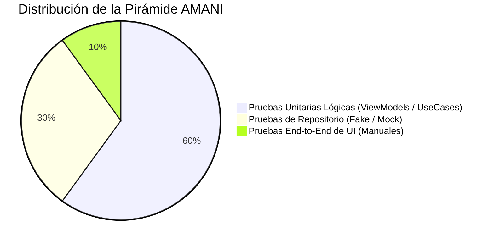

# Estrategia de Pruebas y Cobertura

Validar la estabilidad lógica e integridad técnica es fundamental para AMANI. No obstante, al tratarse de un Proyecto Final de Ciclo (PFC) desarrollado por un número limitado de ingenieros con estrictas restricciones de tiempo, la estrategia de aseguramiento de calidad (QA) debe ser priorizada inteligentemente usando el concepto de "Pirámide de Testing".

## La Pirámide de Testing Aplicada

Para este proyecto, el foco se concentra de manera abrumadora en las **Pruebas Unitarias**. Estas pruebas se ejecutan milisegundos directamente en la máquina virtual local del desarrollador (JVM), sin requerir el arranque costoso de un simulador visual Android completo ni de las librerías físicas del teléfono.

### Qué elementos están rigurosamente cubiertos

1. **Modelos de Vista (ViewModels)**: Se validan absolutamente todos los flujos de transformación de estado. Esto asegura que la lógica transaccional actúe de manera predecible.
2. **Casos de Uso (Domain)**: Por su altísima fragilidad lógica, todas las ramas condicionales de validación son sometidas a comprobación unitaria mediante el marco temporal oficial `JUnit`.
3. **Contratos (Repositorios Falsos)**: Se evalúa cómo el código reacciona cuando los orígenes arrojan excepciones graves de red (utilizando *Fakes* de prueba).

### Qué elementos se han excluido (Scope Académico)

Debido al alcance académico definido del PFC, se excluyen rigurosamente de la cobertura en el pipeline automatizado:
- **Pruebas de Instrumentación Automatizadas (Espresso / Compose UI)**: Escribir y dar mantenimiento a los scripts visuales conlleva un esfuerzo titánico que sobrepasa el cronograma estricto dispuesto para la entrega final en mayo de 2026.
- **Inyección Transaccional Total**: La correcta resolución de Koin se valida de forma manual en lugar de ejecutar una auditoría robótica de constructores, ya que los fallos del árbol se denotan claramente en las pruebas unitarias fallidas.

!!! warning "Políticas de Cobertura Continua"
    Cualquier código funcional nuevo agregado a los módulos `domain` y `viewmodels` debe venir imperativamente empaquetado junto a sus validaciones `MockK` correspondientes. El revisor del proyecto tiene el derecho de rechazar cualquier código introducido carente de una prueba lógica directa.
