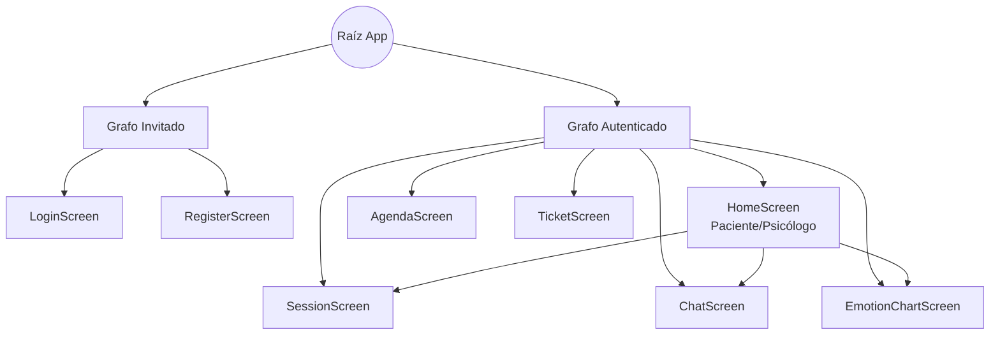

# Sistema de Navegación

El manejo eficiente y correcto de las jerarquías de navegación de pantalla es fundamental. Amani Android desecha por completo el sistema obsoleto basado en pilas gigantescas de dependencias de "Activities" o de "Fragments" manuales, en favor del oficial y declarativo **Navigation Compose**. 

## Grafo Direccional Completo

A continuación, se representa de manera visual la arquitectura estructurada de los árboles direccionales y su anidación en base a las sesiones de los actores del sistema:



## Tabla de Rutas Direccionales

Las ubicaciones se gestionan a través de cadenas fuertemente tipadas y organizadas conceptualmente de forma lógica para garantizar que los modelos expulsen los flujos correctamente en base al nivel de autorización.

| Cadena de Ruta (Route) | Pantalla Objetiva (Screen) | ¿Requiere Autenticación de Firebase? |
| :--- | :--- | :--- |
| `auth/login` | `LoginScreen` | No |
| `auth/register` | `RegisterScreen` | No |
| `main/home` | `HomeScreen` | **Sí** (JWT Válido Necesario) |
| `main/chat/{sessionId}` | `ChatScreen` | **Sí** |
| `main/emotions` | `EmotionChartScreen` | **Sí** |
| `main/agenda` | `AgendaScreen` | **Sí** (Exclusivo Rol Psicólogo) |
| `main/support` | `TicketScreen` | **Sí** |

## Gestión Compleja de Enlaces Profundos (Deeplinks)

Cuando un evento asíncrono externo sacude la aplicación (como una notificación remota generada a través de Firebase Cloud Messaging alertando sobre un nuevo mensaje en el chat del paciente), es indispensable mover la interfaz del usuario hacia la pantalla correspondiente automáticamente.

Para interceptar y gobernar elegantemente el deeplink asociado a un evento (ej. una nueva sesión confirmada), la clase constructora del host intercepta los argumentos definidos en el URI dentro de la firma base:

```kotlin
composable(
    route = "main/chat/{sessionId}",
    deepLinks = listOf(navDeepLink { uriPattern = "amani://app/chat/{sessionId}" })
) { backStackEntry ->
    // Extracción segura del argumento de la ruta
    val sessionId = backStackEntry.arguments?.getString("sessionId")
    ChatScreen(sessionId = sessionId)
}
```

!!! warning "Validación de Acceso con Enlaces Profundos"
    Si la aplicación se despierta repentinamente al pulsar en una alerta gráfica e intenta enrutar al usuario directamente hacia una pantalla que requiere verificación (como `main/chat`), el árbol central de navegación debe interceptar dicha ruta, validando rápidamente la expiración de la memoria del JWT en el `DataStore`. Si ha caducado, deberá redirigir inmediatamente la experiencia hacia el `LoginScreen`.
